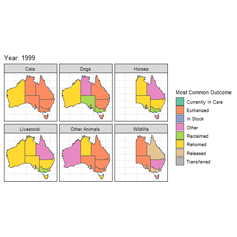

[This assignment is for ETC5521 Assignment 2 by Team `r rmarkdown::metadata$team` comprising of `r knitr::combine_words(rmarkdown::metadata$author)`.]{style="color:#006DAE;"}


# Introduction and motivation

Animals are all around us in the sky, in the oceans, in our backyards, and our homes. What happens to these animals in trouble, it could be cats, dogs, horses, or livestock? Who takes care of them when they are in trouble or are lost? The answer is the Royal Society for the Prevention of Cruelty to Animals. You can find more about RSPCA or the Royal Society for the Prevention of Cruelty to Animals [here](https://www.rspca.org.au/). @About_Us.  

The RSPCA is Australia’s oldest, largest and most trusted animal welfare organization, according to its description, there is a gradual increase in the number of animals every year which are received in animal shelters and adoption centers across the country. RSPCA decides to analyze the results of animals in Australia and help them.

While looking online and researching RSPCA we came across many articles that were indirectly blaming RSPCA for their high euthanize rates and some individuals who saw the worst side of RSPCA. That got us interested in the outcomes from RSPCA and as RSPCA operates state wise. After a while, it raised a question about which animal is euthanized most. One of the recent events that motivated us looking into the euthanization rates, you can read about it by clicking [here](https://mobile.abc.net.au/news/2020-02-26/rscpa-qld-issues-apology-after-accidentally-euthanasing-kitten/12001668).  @powell_2020

We also came across multiple articles and web pages dedicated to the adoption of animals that have been in the care of RSPCA. We wanted to know which state rehomes the most animals. If you are interested please click this [link](https://www.rspca.org.au/adopt-pet). @Adopt_A_Pet

Finally, cat person or dog person a comparison between the two types of people out there, which lost pet is most likely to get reclaimed.


# Data description

There are three data tables separately coming from the RSPCA, Townsville Animal Complaints, and Brisbane Open Data - Animal Complaints.

__1. animal_outcomes.csv__

*year*: Full year

*animal_type*: Animal type (horse, wildlife, dog, cat, etc)

*outcome*: 	Animal outcome - euthanized, released, rehomed, etc

*ACT*: ACT - Australian Capital Territory

*NSW*: New South Wales

*NT*: Northern Territory

*QLD*: Queensland

*SA*: South Australia

*TAS*: Tasmania

*VIC*: Victoria

*WA*: Western Australian

*Total*: Australian Total

__2. animal_complaints.csv__

*Animal Type*: Animal Type

*Complaint Type*: Complaint type

*Date Received*: Date received (Month - year)

*Suburb*: Suburb/region

*Electoral Division*: Electoral Division

__3. brisbane_complaints.csv__

*nature*:	Nature of complaints (animal)

*animal_type*: Animal type

*category*: Category of complaint

*suburb*: Suburb where reported

*date_range*: Date range (typically 1 quarter + year)

*responsible_office*: Responsible office for the complaint

*city*: City (Brisbane)

## Limitations

The animal_outcomes data set has not specified that suburbs, which limit our approach to identifying which suburb has the most common complaint type. This can also help to identify which suburb has the most animal type too by looking into the animal type the complaint was made against. Similarly, the electoral divisions are of no significance with the data frame they are not specified and are not easy to distinguish. 

In the animal_complaints data set the question that comes up is of adoption which the outcome variable talks about reclaimed and rehomed, but it does not tell us if the animals were reclaimed or rehomed in the same state.   

In the brisbane_complaints data set the date range is difficult to apprehend, because of fluctuating ranges and inconsistencies.


 
```{r setup, include=FALSE}
knitr::opts_chunk$set(echo = F, message = FALSE, warning = FALSE)
```

```{r libraries}
library(tidytuesdayR)
library(tidyr)
library(ggplot2)
library(dplyr)
library(rgdal)
library(maptools)
library(plyr)
library(rgeos)
library(plotly)
library(mapproj)
library(leaflet)
library(tmaptools)
library(sf)
library(broom)
library(kableExtra)
library(treemapify)
library(leaflet)
library(forcats)
```

```{r load-data, echo=FALSE, message=FALSE, cache=TRUE, include=FALSE}

tuesdata <- tidytuesdayR::tt_load(2020, week = 30) #downloading the data set as instructed in the git repo
```

```{r data, cache=TRUE}
animal_outcomes <- tuesdata$animal_outcomes  #seperating the data files for easier navigation
animal_complaints <- tuesdata$animal_complaints
brisbane_complaints <- tuesdata$brisbane_complaints
```


# Questions


## Q1: How effective are the RSPCA at producing 'good outcomes' for animals in Australia?

The primary goal of the RSPCA, as stated on their [website](https://www.rspca.org.au/what-we-do), is the contribution to "animal welfare" in Australia. Many animals are taken into care by the RSPCA that are neglected, reported, lost or require professional care. However, sometimes the RSPCA are forced into make the tough decision to euthanize animals when it is the most humane alternative. This could be due to causes such as medical issues or behavioral problems. 

So how effective are the RSPCA at achieving their goal? This question will analyse the RSPCA's success at achieving 'good outcomes' for the animals that come into their care.

For this analysis, the outcomes; rehomed, in care, in stock, reclaimed, released, transferred and currently in care were considered as 'good outcomes', essentially anything beside euthanization. Let us look at the animals saved by RSPCA or the rescue rate. 

```{r rdsmap}

aus_map <- readRDS("oz_map.rds") #loading the rds map file 

```

```{r goodoutcomes}

q1 <- animal_outcomes %>% select(-year, 
                   -animal_type) %>% 
  group_by(outcome) %>% 
  summarise_at(vars(ACT, 
                    NSW, 
                    NT, 
                    QLD, 
                    SA, 
                    TAS, 
                    VIC, 
                    WA),  
               list( sum),na.rm=TRUE) #suming up the outcomes category wise


q11 <-  pivot_longer(q1, `ACT`:`WA`, 
                     names_to = "State", 
                     values_to = "outcomes") %>% 
  pivot_wider(names_from = outcome, 
              values_from = outcomes) #wranggling to get better visualizing sense

q11 <- q11 %>%  mutate(good_outcome = (rowSums(q11[,c(-1,-3)]))/rowSums(q11[,c(-1)])*100) #calculating percentage of good outcomes by taking out euthanization and dividing it by the total number of outcomes per state 

                                                                                                    
q12 <- q11 %>% select(State,                                                                                                       good_outcome)           #selecting variables for ease 
                                                                                                    
                                                                                                    
```


```{r states}
aus_map_states <- aus_map %>% 
  left_join(q12, by = c("state_abb" = "State"))  #joining data sets by states
 

```

```{r leaflet, fig.cap="Positive animal outcomes by state"}
colours <- aus_map_states$good_outcome

cpal <- colorNumeric("Blues", colours)

leaflet(aus_map_states) %>%
  addProviderTiles("CartoDB.Positron") %>%
  addPolygons(stroke = FALSE,
              smoothFactor = 0.2,
              fillOpacity = 1,
              label = paste0(aus_map_states$state, " ", round(aus_map_states$good_outcome, digits = 2), "%"),
              color = ~cpal(good_outcome)) %>%
  addLegend("bottomleft", pal = cpal, values = ~good_outcome,
            title = "Percentage of Positive Outcomes",
            labFormat = labelFormat(suffix = "%"))
```

Figure \@ref(fig:leaflet), shows the rate of animals that were in the care of the RSPCA that experienced a 'good outcome', from the year 1999 to 2018 in each state. The plot clearly shows that Western Australia outperformed all other Australian states, recording a rate of over 75% for positive outcomes. In comparison, New South Wales had the lowest 'good outcome' rate at just 53%, followed closely by Queensland at 53%. This suggests that almost half of all animals received by the RSPCA over this time in these states were euthanized, well behind the performance of the other states. Thus, these areas should be of focus for the RSPCA. As this graphic was made interactive, users can hover over any state to explore the exact rate in each region.  

So while it definitely appears that certain states are outperforming others, it is important to consider how this rate has changed over time. Before comparing statistics on a state-by-state basis however, a national overview was produced below in Figure \@ref(fig:ridges). This graphic displays density plots of the distribution of positive outcomes for each year contained within the data set. Reading down the years, a clear improvement in performance can be seen. Beginning in 1999, not only is the average value lower, there is also a lot of variability in the rates recorded between states. However, over the years up until 2018, the average rate improves to approximately 75% nationally without the multi-modal distribution observed previously. This suggests that the RSPCA's success at achieving their primary goal has indeed gotten better over the years.
```{r ridges, fig.cap="Change in positive outcomes over time, with Year on the y-axis and the percentage of positive outcomes on the x-axis"}
library(ggridges)
yearly_aus <- animal_outcomes %>% 
  group_by(outcome, year) %>% 
  summarise_at(vars(ACT, 
                    NSW, 
                    NT, 
                    QLD, 
                    SA, 
                    TAS, 
                    VIC, 
                    WA),  
               list( sum),na.rm=TRUE) %>% 
  pivot_longer(`ACT`:`WA`, 
                     names_to = "State", 
                     values_to = "outcomes") %>%
  group_by(year, State) %>%
  summarise(good_outcome = sum(outcomes[outcome != "Euthanized"])/sum(outcomes)*100) %>%
  mutate(year = as.factor(year))


yearly_aus %>%
  mutate(year = fct_rev(year)) %>%
  ggplot(aes(x = good_outcome, y = year)) +
  geom_density_ridges(scale = 4) +
  theme_bw() +
  labs(x = "Percentage of Positive Outcomes", y = "Year") +
  ggtitle("Change in positve outcomes over time")
```


Following this, the outcomes over time were further broken down into a state-by-state basis for comparison with Figure \@ref(fig:leaflet). Figure \@ref(fig:time) paints a more positive picture than the map examined earlier. Every state in the country has shown a general trend of improvement over the years captured by the data. New South Wales in particular, the lowest overall, has shown the greatest improvement in recent years. Mousing over the last recorded year, it can be seen that over 96% of animals experienced a 'good outcome' from the RSPCA in 2020. This is far above their overall average of 53%. The only state not too show obvious improvement was Western Australia. The highest averaging state instead maintained its rate over the time frame, with a noticeable drop in 2008 to 52%. This is quite unusual considering its overall performance and the fact that rates of 91% were recorded in both 2007 and 2009. Despite this, the trend across the country is positve for both the RSPCA and the future of Australian animals.

```{r time, fig.cap="Change in positve outcomes over time per state with percentage of positive outcomes on the x-axis and the year on the y-axis, faceted by state"}
yearly_outcomes <- yearly_aus %>%
  mutate(year = as.numeric(year) + 2000)

yearlyplot <- yearly_outcomes %>%
  ggplot(aes(x = year, y = good_outcome)) +
  geom_line() +
  facet_wrap(~ State) +
  theme_bw() +
  labs(x = "", y = "") +
  ggtitle("Change in positve outcomes over time per state")

ggplotly(yearlyplot) %>%
  config(displayModeBar = F)
```

Speaking of Australian animals, a final measure to evaluate the RSPCA on is their performance by animal over time.
```{r animaltime, fig.width=10, fig.height=10, fig.cap="Change in positve outcomes over time by animal with rate on the y-axis and year on the x-axis, faceted by animal type"}
yearly_animal <- animal_outcomes %>%
  group_by(outcome, animal_type, year)%>% 
  summarise_at(vars(ACT, 
                    NSW, 
                    NT, 
                    QLD, 
                    SA, 
                    TAS, 
                    VIC, 
                    WA),  
               list( sum),na.rm=TRUE) %>% 
  pivot_longer(`ACT`:`WA`, 
                     names_to = "State", 
                     values_to = "outcomes") %>%
  group_by(animal_type, year, State) %>%
  summarise(good_outcome = sum(outcomes[outcome != "Euthanized"])/sum(outcomes) * 100)

animalplot <- yearly_animal %>%
  group_by(animal_type, year) %>%
  summarise(avg = mean(good_outcome, na.rm = TRUE)) %>%
  ggplot(aes(x = year, y = avg)) +
  facet_wrap(~animal_type) +
  geom_line() +
  theme_bw() +
  labs(x = "", y = "") +
  ggtitle("Change in positve outcomes over time by animal") +
  scale_x_continuous(breaks = c(2000,2008,2016), limits = c(1999,2018)) +
  scale_y_continuous(breaks = c(0,50,100), limits = c(-10,110))

ggplotly(animalplot) %>%
  config(displayModeBar = F)
```


## Q2: Is there a relationship between the type of animal and its outcome?

We begin by looking at the overall data
```{r animaloutcomes}
ind_outcomes <- animal_outcomes %>%
  group_by(animal_type, outcome) %>%
  summarise(count = sum(Total))

ovr_outcomes <- animal_outcomes %>%
  group_by(animal_type) %>%
  summarise(count = sum(Total))

prop_outcomes <- left_join(ind_outcomes, ovr_outcomes, by = c ("animal_type" = "animal_type")) %>%
  mutate(prop = count.x/count.y)

prop_outcomes %>%
  ggplot(aes(x = animal_type, y = prop, fill = animal_type)) +
  geom_col() +
  facet_wrap(~outcome) +
  labs(x = "", y = "Proportionate Outcome", fill = "Animal Type") +
  scale_x_discrete(breaks = NULL) +
  scale_y_continuous(labels = scales::percent) +
  scale_fill_brewer(palette = "Set2") +
  ggtitle("Proportionate outcomes for different animals") +
  theme_bw()
```
We can also look at how this has changed over time
```{r animalovtime}
ind_outcomes_yr <- animal_outcomes %>%
  group_by(animal_type, outcome, year) %>%
  summarise(count = sum(Total))

ovr_outcomes_yr <- animal_outcomes %>%
  group_by(animal_type, year) %>%
  summarise(count = sum(Total))

prop_outcomes_year <- left_join(ind_outcomes_yr, ovr_outcomes_yr, by = c ("animal_type" = "animal_type", "year" = "year")) %>%
  mutate(prop = count.x/count.y)

animal_time_plot <- prop_outcomes_year %>%
  ggplot(aes(x = year, y = prop, colour = animal_type)) +
  geom_line() +
  facet_wrap(~outcome) +
  scale_y_continuous(labels = scales::percent, breaks = c(.20,.40,.60)) +
  scale_colour_brewer(palette = "Set2") +
  scale_x_continuous(breaks = c(2000,2008,2016), limits = c(1999,2018)) +
  labs(x = "", y = "", colour = "Animal Type") +
  theme_bw() +
  ggtitle("Change in proportionate animal outcomes over time")

ggplotly(animal_time_plot) %>%
  config(displayModeBar = F)
```
```{r animdata}
animal_state <-  animal_outcomes %>%
  pivot_longer(cols = ACT:WA, names_to = "State") %>%
  group_by(year, animal_type, outcome, State) %>%
  summarise(count = sum(value))

animal_ovr <- animal_outcomes %>%
  pivot_longer(cols = ACT:WA, names_to = "State") %>%
  group_by(year, animal_type, State) %>%
  summarise(count = sum(value))

prop_outcomes_state <- left_join(animal_state, animal_ovr, by = c ("animal_type" = "animal_type", "year" = "year", "State" = "State")) %>%
  mutate(prop = count.x/count.y)

top_outcomes <- prop_outcomes_state %>%
  group_by(State, year, animal_type) %>%
  arrange(prop) %>%
  top_n(1)
```

And what about by state?
```{r animalstate, cache=TRUE, eval=FALSE}
library(gganimate)
library(transformr)

fort_map <- fortify(aus_map)

outcomes_map <- fort_map %>%
  left_join(top_outcomes, by = c("state_abb" = "State"))


newdf <- lapply(seq_len(5), function(i) {
  new <- outcomes_map
  new$group <- seq_len(nrow(new))
  new$value <- sample(letters[1:4], nrow(new), replace = TRUE)
  new$time <- i
  new
})
newdf <- do.call(rbind, newdf)


anim <- newdf %>%
  ggplot(aes(fill = outcome, x = longitude, y = latitude, group = group)) +
  geom_sf(aes(x = longitude, 
                  y = latitude,
              geometry = geometry)) +
  ggtitle("Change in proportionate animal outcomes over time by state") +
  scale_fill_brewer(palette = "Set2") +
  theme_bw() +
  theme(axis.title = element_blank(),
        axis.text =  element_blank(),
        axis.ticks = element_blank()) +
  facet_wrap(~animal_type) +
  labs(title = 'Year: {frame_time}', fill = "Most Common Outcome") +
  transition_time(as.integer(year))

anim_save("anim.gif", anim)
```

```{r, fig.cap="Change in proportionate animal outcomes over time by state"}

```


-> There are lot of animals that pass through RSPCA let us look at which animal is euthanized the most by RSPCA in Australia.

```{r getting counts, include=FALSE}
animal_outcomes  %>% group_by( year,
                 outcome, 
                 animal_type) %>%                         
  summarise_at(vars(ACT, 
                    NSW, 
                    NT, 
                    QLD, 
                    SA, 
                    TAS, 
                    VIC),  
               list( sum)) 

q2 <- animal_outcomes %>% filter(outcome == "Euthanized") %>% 
  select(animal_type, 
         ACT, 
         NSW, 
         NT, 
         QLD, 
         SA, 
         TAS, 
         VIC, 
         WA) %>%  
  group_by(animal_type) %>%                         
  summarise_at(vars(ACT,          #getting sums with respect to state
                    NSW, 
                    NT, 
                    QLD, 
                    SA, 
                    TAS, 
                    VIC, 
                    WA),            
               list(" " = sum)) 

 q2$total_animals_euthanised = rowSums(q2[,c(-1)], na.rm=TRUE) #getting the sum of total animals euthanized
```


```{r AustraliaEuthanizationcount, fig.width=8, fig.height=8, fig.cap="Animal Euthanization count"}
options(scipen=999)
 p2 <- ggplot(q2,
              aes(x =reorder(animal_type, 
                             -total_animals_euthanised), #arranging the plot
                  y =  total_animals_euthanised)) + 
   geom_bar(stat="identity", 
            fill="tomato3") +                          #adding color
   labs(subtitle="Which animal is the most euthanized", 
       y="Count", 
       x="Animals", 
       title="Australia Euthanization count",                   #giving title
       caption = "Australia Euthanization rate") + 
  theme(axis.text.x = element_text(angle=45, vjust=0.9)) + 
   ylim(c(0, 600000)) 

ggplotly(p2)
```

Figure  \@ref(fig:AustraliaEuthanizationcount), shows us the euthanization count by animal type throughout Australia from the year 1999 to 2018. Cats have the highest recorded euthanization count at 553,956 in Australia under the care of RSPCA. 

```{r model}
library(DT)

model_data <- prop_outcomes_state %>%
  select(year, State, animal_type, outcome, prop) %>%
  group_by(year, State, animal_type) %>%
  pivot_wider(names_from = outcome, values_from = prop) %>%
  mutate(State = as.factor(State),
         animal_type = as.factor(animal_type)) %>%
  rename("InStock" = "In Stock",
         "InCare" = "Currently In Care")

model_fun <- function(x) {
  model <- lm(paste(x, "~", "animal_type"), data = model_data)
  tidy(model) %>%
    tidycat::tidy_categorical(model) %>%
    dplyr::mutate(Outcome = x)
}

glance_fun <- function(x) {
  model <- lm(paste(x, "~", "animal_type"), data = model_data)
  glance(model) %>%
    select(r.squared) %>%
    mutate(Outcome = x)
}

model_table <- bind_rows(model_fun("Euthanized"),
          model_fun("Reclaimed"),
          model_fun("Rehomed"),
          model_fun("Other"),
          model_fun("InStock"),
          model_fun("Transferred"),
          model_fun("InCare"))  %>%
  select(level, estimate, std.error, p.value, Outcome)

glance_table <- bind_rows(glance_fun("Euthanized"),
          glance_fun("Reclaimed"),
          glance_fun("Rehomed"),
          glance_fun("Other"),
          glance_fun("InStock"),
          glance_fun("Transferred"),
          glance_fun("InCare"))

comb_table <- left_join(model_table,
                        glance_table) %>%
  mutate_at(vars(estimate:std.error, r.squared), funs(round(., 3))) %>%
  mutate(p.value = round(p.value, digits = 6)) %>%
  select(Outcome, r.squared, level:p.value)

datatable(comb_table,
          rownames = FALSE, 
          caption = "Outcome by animal type model statistics", 
          class = "cell-border stripe")
```


## Q5: Cats versus dogs who are more likely to get reclaimed?
 

-> A very interesting question are there more cat people or dog people. 


```{r screening}
animal_outcomes3 <- animal_outcomes %>%
  filter(outcome == "Reclaimed") %>%
  filter(animal_type == c("Dogs", "Cats")) #filtering required animal types
```

```{r plot4, fig.width = 8, fig.height = 6, fig.cap="Reclaimed animals: Timeline", fig.align= "center"}
p4 <-  ggplot(animal_outcomes3, 
              aes( x = year,
              y = Total, 
              group = as.factor(animal_type),
              shape = as.factor(animal_type),
              colour = as.factor(animal_type))) +
  geom_line() +
  geom_point() +
  ggtitle("Reclaimed animals: Timeline") +
  theme(legend.title=element_blank())

ggplotly(p4)
```

In Figure  \@ref(fig:plot4), from 1999 to 2018 the number of reclaimed cats has been stable, while the number of reclaimed dogs has fluctuated over the years. 2009 was a good year for dogs.

### While we are at the subject of cats versus dogs, who gets the most complaints? 

```{r complaints}
x1 <- animal_complaints %>% 
  select(`Animal Type`) %>%  #selecting animal type to get total count oer animal type 
  count() 

```


```{r ComplaintsagainstwhoCatsorDogs, fig.cap="Complaints against who: Cats or Dogs"}
p4e <- x1 %>% ggplot(aes(x = Animal.Type, 
                 y = freq)) + 
  geom_bar(stat="identity", 
           fill="yellow") + 
  ylab("number of complaints") + xlab(" ") +  ggtitle("Complaints Launched")

ggplotly(p4e)
```


Figure  \@ref(fig:ComplaintsagainstwhoCatsorDogs),  shows that dog complaints made by people are disproportionately higher than complaints against cats.

### What are the most frequent complaints in Brisbane?

```{r brisbanecomplaints}
brisbane_complaints_category <- brisbane_complaints  %>% select(category) #selecting category

brisbane_complaints_category <- brisbane_complaints_category %>% 
  group_by(category) %>% 
  tally()                   #getting tally of the compalints made in brisbane

brisbane_complaints_category <- na.omit(brisbane_complaints_category)
```

```{r treemap, fig.cap="Complaints made in Brisbane"}

 p9 <- ggplot(brisbane_complaints_category, 
              ggplot2::aes(area = n,
                           label = category, 
                           fill = category)) + 
 geom_treemap() + 
  geom_treemap_text( stat = "identity", 
                     position = "identity", 
  na.rm = FALSE, 
  show.legend = FALSE, 
  inherit.aes = TRUE, 
  padding.x = grid::unit(1, "mm"), 
  padding.y = grid::unit(1, "mm"), 
  place = "topleft", 
  min.size = 4, 
  grow = FALSE, 
  reflow = FALSE, 
  fixed = NULL, 
  layout = "squarified", 
  start = "bottomleft") 
p9 +  ggtitle("Complaints made in Brisbane")
```

Figure  \@ref(fig:treemap), shows us that in Brisbane the highest complaint rate is Fencing issues, followed by wandering animals, attack on animals, and attack on a person. 

## Q6: How the different type of complaints are distributed in dogs and cats?


# Conclusion

In conclusion, RSPCA does what is best for the animals, there may be other factors involved such as state laws, size of the state, wildlife concentration, population in the state, that needs to be taken under consideration when looking at things such as good outcome rates, euthanization counts, rehomed animals, etc. 


The R packages we used in this report: 
@tidytuesdayR
@tidyr,  
@ggplot2, 
@dplyr,
@rgdal,
@maptools,
@plyr,
@rgeos,
@plotly, 
@mapproj, 
@leaflet, 
@tmaptools, 
@sf,
@broom,
@kableExtra,
@treemapify


# References
